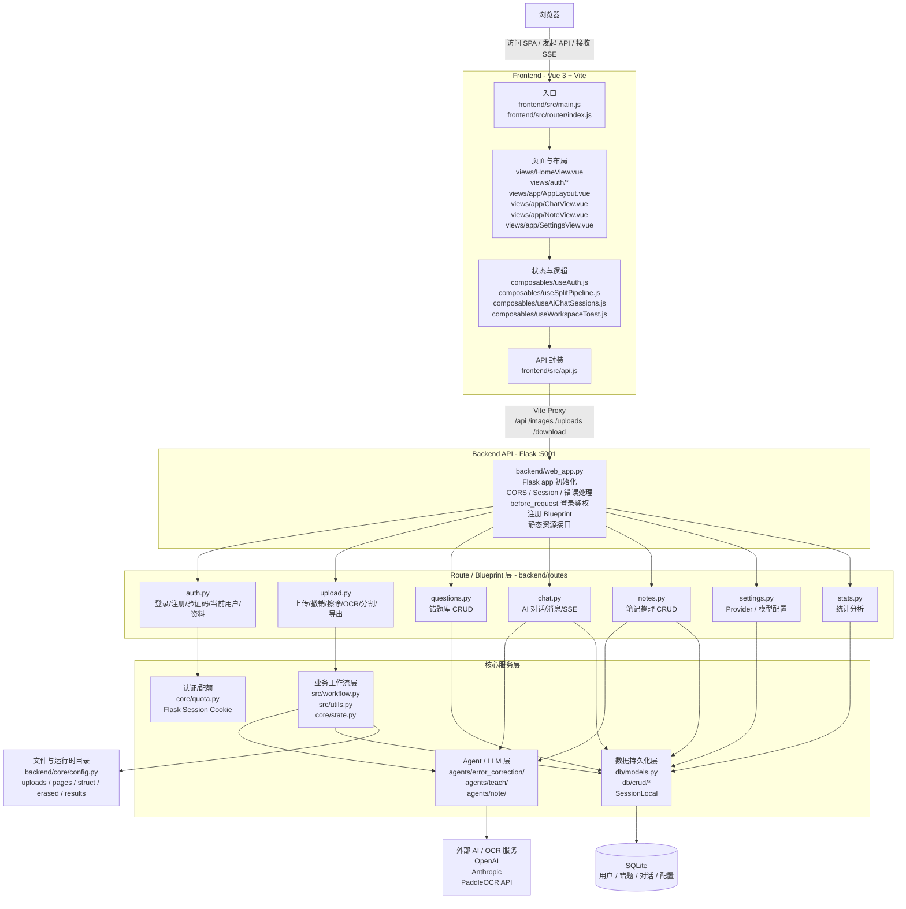

# 当前前后端架构图

本文档基于当前代码结构，描述项目的前后端整体架构、核心模块分层与主要业务流。

---

## 整体架构图



---

## 关键业务流图

```mermaid
flowchart TD
  User[用户上传试卷 / 图片] --> FE[前端页面 Vue]
  FE -->|uploadFiles()| UploadAPI[POST /api/upload]
  UploadAPI --> UploadRoute[backend/routes/upload.py]
  UploadRoute --> SaveFile[保存原文件到 uploads]
  UploadRoute --> SessionState[记录到 session_files]
  SessionState --> WaitAction[等待用户继续操作]

  WaitAction --> UserAction[用户点击 擦除 / OCR / 分割]
  UserAction --> SplitRoute[backend/routes/upload.py]
  SplitRoute --> Workflow[backend/src/workflow.py]

  Workflow --> PrepareInput[prepare_input()]
  Workflow --> OCR[PaddleOCRClient 调 OCR]
  Workflow --> Simplify[simplify_ocr_results()]
  Workflow --> Batch[构建 2 页/批 + 1 页重叠 batch]
  Workflow --> SplitLLM[LLM 分割题目]
  Workflow --> Dedup[去重 / 路径修正]
  Workflow --> CorrectLLM[LLM 纠错]
  Workflow --> Result[生成题目结果]

  Result --> FEBack[返回前端展示]
  FEBack --> Export[导出 Markdown]
  FEBack --> SaveDB[保存到错题库]
  FEBack --> AIChat[进入 AI 对话 / 笔记整理]
```

---

## 分层说明

### 1. 前端层

前端是一个工作台型单页应用，主要负责：

- 页面路由与布局切换
- 登录态管理
- 上传与分割流程控制
- AI 对话界面
- 系统设置界面

核心文件：

- `frontend/src/main.js`
- `frontend/src/router/index.js`
- `frontend/src/api.js`
- `frontend/src/composables/useAuth.js`
- `frontend/src/composables/useSplitPipeline.js`

### 2. API 层

Flask API 层主要负责：

- 路由注册
- 登录鉴权
- 参数校验
- 调用 workflow / crud / agent
- 统一返回 JSON

核心文件：

- `backend/web_app.py`
- `backend/routes/`

### 3. 工作流层

这是项目最核心的业务引擎，负责：

- 文件预处理
- OCR
- 题目分割
- 结果去重
- 纠错
- 导出

核心文件：

- `backend/src/workflow.py`

### 4. Agent / 模型层

负责 AI 能力本身：

- 题目分割
- OCR 后纠错
- 教学讲解
- 笔记整理

核心目录：

- `backend/agents/error_correction/`
- `backend/agents/teach/`
- `backend/agents/note/`

### 5. 数据层

负责持久化以下数据：

- 用户
- 错题库
- 标签
- 对话会话
- provider 配置

核心文件：

- `backend/db/models.py`
- `backend/db/crud/`
- `backend/db/__init__.py`

---

## 关键连接点

如果要快速建立全局理解，建议优先盯住这几个连接点：

1. 前端 API 封装：`frontend/src/api.js`
2. 后端总入口：`backend/web_app.py`
3. 上传/分割主链路：`backend/routes/upload.py` + `backend/src/workflow.py`
4. AI 对话链路：`backend/routes/chat.py`
5. 数据库落库：`backend/db/models.py` + `backend/db/crud/`

---

## 一句话总结

这个项目可以概括为：

> Vue 工作台前端 + Flask API 编排层 + LangGraph/Agent 工作流层 + SQLite 持久化 + 外部 LLM/OCR 服务
